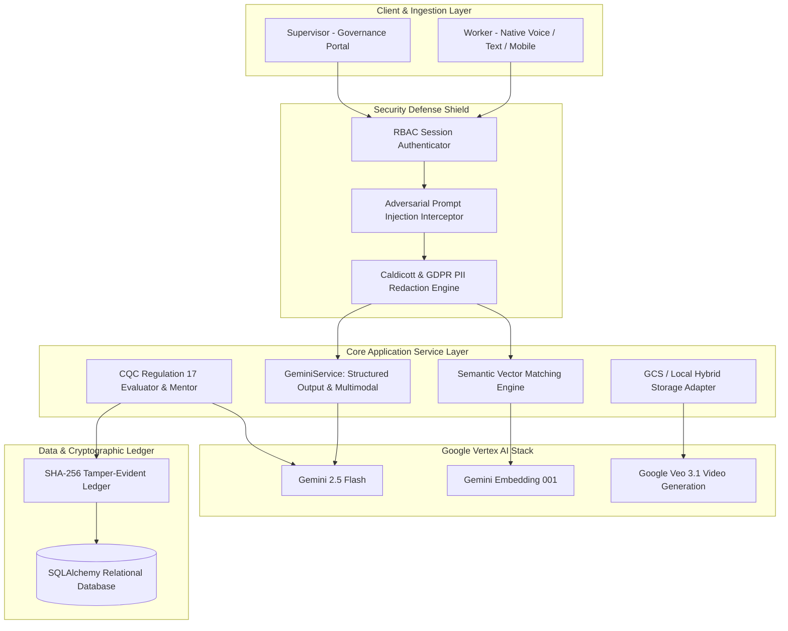

# CareTaker &mdash; AI-Powered Care. Any Language. Full Compliance.

<div align="center">

**Developed by Team Byte Builders&trade;**

[-orange.svg?logo=google&logoColor=white)](#hackathon-context--timeline-11--18-march-2026)
[](https://python.org)
[](https://palletsprojects.com/p/flask/)
[](https://cloud.google.com/vertex-ai)
[-red.svg?logo=shield&logoColor=white)](#secure-by-design-security-architecture)
[](#cqc-regulatory-compliance-framework)
[](https://caretaker-ai-0mu3.onrender.com)
[](#render-deployment-guide)
[-brightgreen.svg?logo=pytest&logoColor=white)](#automated-test-suite)

*A production-grade, secure multimodal AI platform empowering care workers, trainers, and healthcare supervisors through multilingual voice ingestion, semantic task matching, automated CQC Regulation 17 compliance reporting, AI practice mentor reviews, and demographic-tailored video training.*

**Live Deployment:** [https://caretaker-ai-0mu3.onrender.com](https://caretaker-ai-0mu3.onrender.com)

</div>

---

## Hackathon Context & Timeline (11 &ndash; 18 March 2026)

This project was built as an official competitive entry for **"The Secure Intelligence Frontier" Hackathon**, convened by **WMG Venture Studio, Warwick Business School (WBS), Google Cloud, and NatWest Accelerator**.

```
+------------------------------------------------------------------------------------------------------+
|                                      OFFICIAL HACKATHON TIMELINE                                     |
+------------------------------------------------------------------------------------------------------+
| • March 11, 2026 (3:00 PM)  | Kickoff & Ideation (IDL Auditorium, University of Warwick)             |
|                             | Technical workshops with Google Cloud & NatWest Accelerator engineers  |
| • March 14, 2026 (10:00 AM) | Semi-Finals (IDL Building, University of Warwick)                      |
|                             | Progress pitch to expert panel of technical and commercial judges      |
| • March 16–17, 2026         | MVP & Deck Polish (Junction Building) with dedicated mentors          |
| • March 18, 2026            | The Grand Final & Demo Day at the Google Offices in London             |
+------------------------------------------------------------------------------------------------------+
```

### The Hackathon Challenge Mandate:
> *"Move beyond a simple demo to create a secure, commercially viable MVP that proactively addresses the unique security vulnerabilities of the AI era."*

CareTaker targets both commercial viability and the **Cyber-Security Excellence Award ("Secure by Design")** by pairing multimodal Vertex AI models with Caldicott/GDPR PII redaction, adversarial prompt injection defense, and cryptographic audit hashing for statutory clinical documentation.

---

## Authors & Team: Byte Builders&trade;

CareTaker is conceived, designed, and engineered by **Byte Builders&trade;**:

- **Ioannis Konstantinou** ([@ayqon](https://github.com/ayqon)) &mdash; Full-Stack Architecture, Security Guardrails & AI Engineering
- **Akanksh Caimi**
- **Mohamed Jemseed Aathik Ahamed**
- **Rumaan Mukadam**
- **Shinja Nagvekar**

> **Copyright & Intellectual Property:**  
> All source code, architectural implementations, and system designs in this repository are the exclusive intellectual property and copyright &copy; 2026 of **Byte Builders&trade;**. Built as an independent competitive entry for the Warwick x Google x NatWest Hackathon (March 2026).

---

## The Problem: The Documentation Skills Gap in Care

In UK health and social care, good documentation keeps vulnerable people safe, verifies standard care delivery, and satisfies statutory audits. However:

- **The Language & Written Barrier:** Trainees and care workers can perform practical care tasks effectively, but struggle with written English (especially with English as an additional language / ESL), leading to missing or delayed documentation.
- **Administrative Drain on Trainers:** Care trainers spend **5 to 10 hours per week** marking and manually correcting care records instead of coaching hands-on clinical skills.
- **Unprepared for Placements:** Incomplete documentation leaves trainees unprepared for real-world placements and exposes providers to CQC penalties under **Regulation 17 (Good Governance)**.

```
+-----------------------------------------------------------------------------------+
|                              MARKET & INDUSTRY IMPACT                             |
+-----------------------------------------------------------------------------------+
| • UK Social Care Economy: £77.8B contribution, 1.6M+ active workforce             |
| • Urgent Demand: 470,000+ new workers required across the UK by 2040              |
| • Global Vocational Training: $388B (2024) -> $649B (2030)                        |
| • Time Saved: 5-10 hours/week per trainer reclaimed for hands-on coaching         |
+-----------------------------------------------------------------------------------+
```

---

## What CareTaker Delivers

```
TRAINER / SUPERVISOR INPUT   -->   AI STRUCTURES   -->   TRAINEE / WORKER DOCUMENTS   -->   AI COMPARES & AUDITS   -->   SEALED CQC REPORT
---------------------------------------------------------------------------------------------------------------------------------------
Supervisor enters care steps        AI converts to        Worker uses voice or text         AI translates, compares        System generates CQC
(e.g., medication round,            action points,        in their own language to          to task embeddings, and        report + SHA-256 seal
personal care plan)                 time & priority       document what they did            flags practice issues          for regulatory audit
```

| Beneficiary | Core Value Delivered |
| :--- | :--- |
| **For Trainees / Workers** | Voice/text input in native language removes barriers; instant feedback builds documentation confidence and prepares workers for placement. |
| **For Trainers / Supervisors** | 5&ndash;10 hours/week saved on marking; objective data highlights learner gaps; real-time semantic task tracking. |
| **For Care Providers & Centres** | Higher completion rates, CQC Regulation 17 compliance by design, and audit-ready clinical records. |

---

## System Architecture & Technical Design

CareTaker is built upon a decoupled **Flask Application Factory (MVC + Service Layer)** pattern:



---

## Google Vertex AI Modality Matrix

| Modality & Capability | Target Model | SDK Method | Implementation & Purpose |
| :--- | :--- | :--- | :--- |
| **Multimodal Audio Understanding** | `gemini-2.5-flash` | `generate_content` (`inline_data` audio blob) | Transcribes field voice notes, detects spoken dialect, and translates to clinical English in a single call. |
| **Structured Output Generation** | `gemini-2.5-flash` | `response_schema` + JSON MIME enforcement | Converts free-form shift logs into 11-field CQC care records and structured supervisory review recommendations. |
| **Semantic Similarity Vectors** | `gemini-embedding-001` | `embed_content` (`SEMANTIC_SIMILARITY`) | Generates 768-dim embeddings to match shift submissions against assigned tasks via cosine similarity. |
| **Video Synthesis** | `veo-3.1-generate-001` | `generate_videos` (Vertex AI) | Generates 8-second 720p instructional training videos tailored to worker demographic needs. |
| **Personalized Script Generation** | `gemini-2.5-flash` | `generate_content` | Produces culturally and linguistically adapted educational training scripts per worker profile. |

---

## "Secure by Design" Security Architecture

Developed to fulfill the **WMG / NatWest Cyber-Security Excellence Award** mandate:

```
+---------------------------------------------------------------------------------------+
|                                SECURITY DEFENSE MATRIX                                |
+------------------------------------+--------------------------------------------------+
| Threat Vector                      | Defensive Architecture & Mitigation              |
+------------------------------------+--------------------------------------------------+
| 1. Multilingual Prompt Injections  | Multi-pattern regex & heuristic filters          |
|    & Jailbreak Payloads            | intercepting override clauses and DAN exploits.  |
| 2. Patient PII / PHI Leakage       | Automated redaction engine stripping UK NHS      |
|    (UK GDPR & Caldicott Standards) | numbers, phone numbers, postcodes, and emails.   |
| 3. Care Record Tampering           | SHA-256 cryptographic digests generated on       |
|                                    | finalization; verifiable via REST API.           |
| 4. Privilege Escalation            | Strict RBAC decorators enforcing worker vs.      |
|                                    | supervisor route access boundaries.              |
+------------------------------------+--------------------------------------------------+
```

---

## CQC Regulatory Compliance Framework

Generated care documentation is validated against **CQC Regulation 17 (Good Governance)** across the five Key Lines of Enquiry (**KLOE**):

1. **Safe:** Medication verification, hydration/fluid intake tracking, and proactive risk/safeguarding notes.
2. **Effective:** Person-centred outcomes and standard clinical procedure adherence.
3. **Caring:** Preservation of dignity, respect, and recording service user emotional responses.
4. **Responsive:** Immediate triggers for changes in mobility, condition, or follow-up care actions.
5. **Well-led:** Tamper-evident cryptographic ledger, AI practice reviews, and continuous learning loops.

---

## Render Deployment Guide

CareTaker is configured for deployment on [Render](https://render.com) using [`render.yaml`](file:///c:/Users/john2/Downloads/New%20folder%20(10)/render.yaml):

### 1-Click / Blueprint Deployment on Render:
1. Push this repository to your GitHub account (**`ayqon`**).
2. Go to your [Render Dashboard](https://dashboard.render.com) &rarr; **New** &rarr; **Blueprint**.
3. Connect your GitHub repository. Render will automatically detect [`render.yaml`](file:///c:/Users/john2/Downloads/New%20folder%20(10)/render.yaml).
4. Set your Environment Variables:
   - `SECRET_KEY`: (Auto-generated by Render)
   - `GOOGLE_CLOUD_PROJECT`: Your GCP project ID
   - `GOOGLE_CLOUD_LOCATION`: `us-central1`
   - `GCS_BUCKET`: Your Google Cloud Storage bucket name (optional)
5. Click **Apply**. Render will install dependencies via `pip install -r requirements.txt` and launch with Gunicorn:
   ```bash
   gunicorn -w 2 -b 0.0.0.0:$PORT app:app
   ```

---

## Local Installation & Setup

```bash
# 1. Clone repository
git clone https://github.com/ayqon/CareTaker-SecureAI.git
cd CareTaker-SecureAI

# 2. Virtual environment setup
python -m venv .venv
.\.venv\Scripts\Activate.ps1   # On Linux/macOS: source .venv/bin/activate

# 3. Install dependencies
pip install -r requirements.txt

# 4. Seed demo database
python seed.py

# 5. Launch local server
python app.py
```
Open **`http://localhost:5001`** in your browser.

**Demo Credentials:**
- **Supervisor:** `supervisor1` / `password123`
- **Care Worker:** `worker1` / `password123`

---

## Automated Test Suite

Run the full `pytest` suite testing all security guardrails, authorization boundaries, and CQC report lifecycles:

```bash
pytest -v
```

```text
============================= test session starts =============================
tests/test_auth_routes.py::test_login_and_logout PASSED                  [ 14%]
tests/test_auth_routes.py::test_rbac_access_control PASSED               [ 28%]
tests/test_auth_routes.py::test_worker_profile_update PASSED             [ 42%]
tests/test_cqc_workflow.py::test_full_cqc_workflow PASSED                [ 57%]
tests/test_security_service.py::test_prompt_injection_detection PASSED   [ 71%]
tests/test_security_service.py::test_pii_redaction_nhs_and_contact PASSED [ 85%]
tests/test_security_service.py::test_sha256_audit_hash_integrity PASSED  [100%]
============================== 7 passed in 2.11s ==============================
```

---

## License & Copyright

&copy; 2026 **Byte Builders&trade;** (Akanksh Caimi, Ioannis Konstantinou, Mohamed Jemseed Aathik Ahamed, Rumaan Mukadam, Shinja Nagvekar). All rights reserved.
